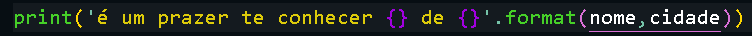

# Minhas anotações em python

# Curso em video

## bibliotecas a estudar

- python game
- math
- time
- randon
- colorize

## Primeiros Passos com Python

No python toda variável é um objeto

- comandos
    
    `print` para escrever coisas na tela
    
    `input` para coletar informações
    
- caso seja necessário inserir variáveis no meio de mensagens pode-se usar o comando `.format()` para ter mais praticidade
    
    
    

## Tratando dados e fazendo contas

- tipos primitivos
    - `int` números inteiros
    - `float` números reais (com virgula)
    - `bool` valores lógicos (bouleanos(verdadeiro e falso))
    - `str` strings (cadeias de caracteres)
- comandos
    
    `type()` mostra o tipo da variável que esta dentro dos parênteses
    
    `variavel.isnumeric()` serve para verificar se a variável é composta por números (existem outros .is)
    

Aspas ‘’’triplas’’’ fazem uma mensagem aparecer no terminal exatamente como ela foi escrita no código

## operadores aritméticos

- operadores em ordem
    - () para priorizar
    - ** potencia
        - % resto da divisão
        - * multiplicação
        - / divisão
        - // divisão inteira
            - + para soma
            - - para subtração

para fazer raiz quadrada de um numero você pode usar um macete `n**(1/2)` e raiz cubica é `n**(1/3)`

é possível multiplicar strings como `print(10*’=’)`

`{:.3f}` faz com que apareçam apenas três casas depois da virgula

`print(’ola mundo’, end=’ ’)` faz com que a linha não seja quebrada

`\n` serve para quebrar a linha 

## usando módulos em python

**QUALQUER TIPO DE IMPORTAÇÃO DEVE SER FEITA NA PRIMEIRA LINHA** 

`import biblioteca` para importar uma biblioteca

`from biblioteca import comando, outro-comando` para importar um comando especifico de uma biblioteca

se você tiver importado uma biblioteca inteira os comandos devem ser usados assim `biblioteca.comando(variavel)` mas se você importou apenas um ou dois você pode representar dessa forma `comando(variavel)` 

para instalar uma biblioteca basta procurar a desejada no site [python.org](http://python.org) e copiar o código e colar no cmd

## manipulando texto

- fatiamento de strings
    - `print(var[9])` mostra apenas o nono caráter da string que esta na variável
    - `print(var[9:13])` mostra os caracteres 9, 10, 11, 12.
    - `print(var[9:21:2])` mostra do 9 ao 20 e pula de dois em dois
    - `print(var[:5])` mostra do inicio até o carácter 4
    - `print(var[15:])` mostra do 15 até o final
    - `print(var[9::3])` mostra do 9 até o final e pula de 3 em 3
    - `print(var[2][3])` mostra a terceira casa do item dois de uma lista
- comandos
    - `print(len(var))` mostra o numero de carácteres de uma string
    - `print(var.count(’o’))` mostra quantos “o” minúsculos tem na string
    - `print(var.count(’o’, 0, 13))` mostra quantos “o” minúsculos tem na string de 0 a 12
    - `print(var.find(’deo’))` procura a sequencia especifica e diz onde ela começa
        - se a tag `.find()` der -1 é porque o valor especificado não existe na string
        - também pode-se usar `‘deo’ in var` para ser retornado True ou false
        - também existe o `print(var.rfind(’deo’)` que faz a leitura da direita para a esquerda
    - `var.replace(’Python’, ‘Androide’)` troca a palavra “python” pela palavra “androide”
    - `var.upper()` faz a variável ficar toda em letras maiúsculas
    - `var.lower()` faz a variável ficar toda em letras minúsculas
    - `var.captalize()` transforma todos os caracteres em letras minúsculas exceto a primeira letra
    - `var.titile()` vai deixar todas as letras minúsculas exceto a primeira de cada palavra
    - `var.strip()` remove os espaços que vem antes e os que vem depois de uma string
    - `var.rstrip()` remove os espaços a direita da string
    - `var.lstrip()` remove os espaços a esquerda da string
    - `var.split()` divide por palavras uma string em uma lista
    - `‘-’join(var)` junta todos os itens de uma lista e transforma em uma string e insere um traço entre cada palavra
    - `f’ola mundo’.replace(’ola’,’oi’)` trocara todos os ‘ola’ da string por ‘oi’
    - `‘ola mundo’.center(30)` vai centralizar a mensagem com 30 casas

## condições if, else

As condições em python funcionam com a seguinte estrutura: se o que vem após o `if` for verdadeiro o primeiro bloco é executado e o segunda é ignorado, porem se a condição for falsa o primeiro bloco é ignorado e o segundo executado. Após isso o codigo segue normalmente.


E também existe a versão simplificada para usos mais específicos, ou a opção de usar apenas o `if` e não utilizar o `else`.


## cores no terminal

`\033[0;33;44m` pode ser usando dentro das aspas de um `print` para aplicar o estilo selecionado até o próximo seletor de cor(se não existir mais um esse será aplicado do ponto que esta até o final). Esse comando serve para colocar cores no terminal, o primeiro 033 é por padrão do comando e os três números seguintes servem para configurar **estilo da fonte**, **cor da letra**, **cor de fundo**


Também pode-se usar o `.format` para inserir os códigos de cor como mostra abaixo 


- estilos de fonte
    - 0 padrão
    - 1 negrito
    - 4 sublinhado
    - 7 deixa as cores negativas
- cores da letra
    - 30 branco (cor padrão)
    - 31 vermelho
    - 32 verde
    - 33 amarelo
    - 34 azul
    - 35 rosa
    - 36 ciano
    - 37 cinza (cor padrão)
- cores de fundo
    - 40 branco (cor padrão)
    - 41 vermelho
    - 42 verde
    - 43 amarelo
    - 44 azul
    - 45 rosa
    - 46 ciano
    - 47 cinza

## condições aninhadas

As condições aninhadas usam o comando `elif` como uma abreviação da estrutura `else if` e são como condições normais porem umas dentro das outras como uma boneca russa. Veja abaixo.

```jsx
nome = str(input('qual é o seu nome? ')).title()
if nome == 'Lucas':
    print('que nome bonito')
elif nome == 'Pedro' or nome == 'maria' or nome == 'paulo':
    print('que nome comun')
elif nome in 'Ana Claudia Jessica Amanda':
    print('belo nome feminino')
else:
    print('seu nome é tão normal')
print('tenha um bom dia {} '.format(nome))
```

## estruturas de repetição

Uma estrutura de repetição serve para fazer um comando se repetir varias vezes se necessário, como se mostra abaixo, onde o comando `passo` será executado 10 vezes antes do comando `pega` ser executado


também pode haver um terceiro numero fazendo com que o comando fique assim `for c in range(1, 10, 2)` que faria com que o comando pule de dois em dois ou o  `for c in range(10, 0, -1)` que faz com que aconteça de trás pra frente. Esse terceiro numero é o passo que deve ser usado

**Resumindo:** A contagem vai do primeiro numero ao segundo numero com o paço designado pelo terceiro numero 

- Abaixo temos laços de tuplas e listas que retornam:
    - o valor de cada comida em lanche
    - a posição de cada comida em lanche
    - a posição e o valor de cada comida em lanche


- Abaixo temos um laço de dicionario que retorna as chaves e os valores


## repetição

- while
    
    `while` é como o for mas sem limite, ele reproduzira o laço enquanto o teste resultar em verdadeiro. Por exemplo:
    
    ```python
    while teste:
    	bloco
    print('Fim')
    ```
    
    Também existe a opção de por `true` para fazer com que o laço funcione infinitamente.  
    
- break
    
    O `break` serve para finalizar um laço independentemente. Quando executado o comando `break` dentro de um laço o fluxo do código será direcionado para o final do laço e seguira normalmente.
    
    ```python
    
    ```
    

## Tuplas ( )

Tuplas são como variáveis porem elas podem conter vários valores

```python
lanche = ('Hamburguer', 'suco', 'pizza', 'pudim')
	or
lanche = 'Hamburguer', 'suco', 'pizza', 'pudim'
```

`print(sorted(lanche))` serve para mostrar uma tupla em ordem alfabética

`print(lanche.index(suco, 0))` faz uma busca mostra em que posição o suco esta dentro da dupla (caso aja um valor repetido pode-se adicionar um numero para que a busca seja feita a partir dele. 

`max(numeros)` retorna o maior valor de uma tupla

`min (numeros)` retorna o menor valor de uma tupla

## listas [ ]

listas são como tuplas porem elas podem ser modificadas.

- comandos
    
    `lanche.append(’cokie’)` adiciona a string ‘cokie’ ao final da lista lanche.
    
    `lanche.insert(0, ’cachorro quente’)` adiciona a string ‘cachorro quente’ no inicio da lista lanche.
    
    `del lanche[3]` ou `lanbche.pop(3)` remove a quarta string da lista
    
    `lanche.remove(’pizza’)` remove a string ‘pizza’ da lista lanche
    
    `valores = list(renge(4, 11)` serve para criar uma lista do 4 até o 11
    
    `valores.sort()` serve para deixar a lista em ordem 
    
    `valores.sort(reverse=True)` serve para deixar a lista em ordem porem de trás para frente
    
    `var = sum(numeros)` cria uma variável com a soma de todos os valores da lista 
    
- usos
    
    listas podem ser colocadas dentro de outras listas
    
    para inserir uma lista dentro de outra deve-se usar o comando `comidas.append(frutas[:])`
    
    para selecionar itens dentro de listas aninhadas pode-se usar colchetes para escolher itens como no caso abaixo
    
    ```python
    galera = [['joão', 19], ['ana', 33], ['joaquim', 13], ['maria', 45]]
    print(galera[0]) #resulta em | ['jão', 19]
    print(galera[0][1]) #resulta em | 19
    ```
    

## dicionários {}

- comandos
    
    `dados = dict()` ou `dados = {}` cria um dicionário com o nome dados
    
    `dados = {’nome’:’pedro’, ‘idade’:15}` cria um dicionário que tem o identificador `nome` para a string ‘pedro’ e o identificador idade para o numero 15
    
    `print(dados[’nome’])` mostra a string ‘pedro’
    
    `dados[’sexo’] = ‘M’` cria um novo item chamado sexo e atribui a letra ‘M’ a ele
    
    `del dados['idade']` remove o item idade
    
    `print(dados.values())` mostra `‘pedro’, 15, ‘m’`
    
    `print(dados.keys())` mostra `nome, idade, sexo`
    
    `print(dados.items())` mostra tudo que tem em dados
    
    `pessoas.append(dados.copy())` serve para adicionar uma copia do dicionário dados na lista/tupla/dicionário pessoas 
    
- uso
    - Obs: se o seletor estiver dentro de um print ele deve ser feito com aspas duplas, `print(*f*'O {pessoas["nome"]} tem {pessoas["idade"]} anos')` dessa forma

## funções

As funções são blocos prontos que você pode criar para definir funcionalidades e aumentar a praticidade na hora de programar, existem funções que vem embutidas no próprio python (todos os comandos que terminam com parênteses).

para criar uma função usasse o comando `def Função():` e se adiciona o bloco desejado.

- esse código
    
    ```python
    def linha():
        print(10*'-')
    
    linha()
    print('ola')
    linha()
    ```
    
- gera esse resultado
    
    
    

Mas também é possível fazer funções personalizadas que são adeptas a valores, como vemos abaixo

- esse código
    
    ```python
    def soma(a, b):
        soma = a+ b
        print(soma)
    
    lin()
    soma(2, 8)
    lin()
    ```
    
- gera esse resultado
    
    
    

Também existe a opção de definir os parâmetros em uma ordem diferente da que foi configurada de inicio mudando o `soma(2, 8)` para `soma(b=8, a=2)` que nesse caso não faz diferença mas é uma possibilidade. E se você quiser fazer uma função que sem um numero fixo de parâmetros, é só usar o comando `def contador(*num):` que vai fazer com que todos os parâmetros sejam adicionados dentro de uma tupla chamada num. E ainda existe a possibilidade de fazer funções com parâmetros opcionais, veja abaixo:

- parâmetros opcionais
    
    Nesse caso se for digitado `somar(1, 2, 3)` será escrito 6 na tela, mas se for digitado `somar(1, 2)` o `c` será considerado como 0 e o resultado na tela vai ser 3  
    
    ```python
    def somar(a, b, c=0):
    	s = a + b + c
    	print(s)
    ```
    

As funções que vem por padrão no python tem por padrão um manual de como as usar, basta digitar `help(print)` no terminal por exemplo, para saber como usar o print. Se você quiser adicionar um manual a sua função basta fazer três aspas duplas e digitado, como mostra abaixo.

- manual
    
    ```python
    def contador(i, f, p):
        """
        ->Faz uma contagem e mostra na tela.
        :param i: inicio da contagem
        :param f: fim da contagem
        :param p: passo da contagem
        :return: sem retorno 
        """
    
        c = i
        while c <= f:
            print(f'{c}', end='')
            c += p
        print('FIM!')
    ```
    

Para fazer com que a função retorne um valor basta usar o comando `return` como mostra abaixo.

- codigo
    
    ```python
    def SomaPar(lista):
        soma = 0
        for numero in lista:
            if numero % 2 == 0:
                soma += numero 
        return soma
    ```
    

## tratamento de erros

Um erro na linguagem de python é apenas quando a um erro sintático, se o erro for de logística e estiver impossibilitando o código de continuar ele é considerado uma exceção, existem inúmeras famílias de exceções no python.

- `try:` é o bloco que será executado
- `except:` é o que acontece se der erro
- `else:` é o que acontece se não der erro [opcional]
- `finally:` acontece independente de o bloco estar certo ou errado [opcional]
- código na pratica
    
    ```python
    try:
        a = int(input('N1: '))
        b = int(input('N2: '))
        r = a/b
    except (ValueError, TypeError):
        print(f'Tivemos um problema com o tipo de dado que você digitou')
    except ZeroDivisionError:
        print('Não é possivel dividir um numero por zero')
    except KeyboardInterrupt:
        print('O usuario preferiu não informar os dados')
    except Exception as erro:
        print(f'[ERRO] O erro encontrado foi {erro.__cause__}')
    else: 
        print(f'Resultado: {r}')
    finally:
        print('Volte sempre')
    ```
    
- ilustração
    
    
    

# Auto didatismo

## Objetos

- [https://www.youtube.com/watch?v=C35cqd5N0h8&t=489s&ab_channel=BósonTreinamentos](https://www.youtube.com/watch?v=C35cqd5N0h8&t=489s&ab_channel=B%C3%B3sonTreinamentos)

As classes são como funções próprias para declarar objetos. Elas servem como fôrmas prontas que tem funções e variáveis contidas, quando queremos criar uma variável que segue um padrão, tipo, ou ***classe…*** podemos atribuir a classe a variável e passar os parâmetros obrigatórios para que ela crie e todas as funcionalidades e valores automaticamente

Geralmente esse tipo de estrutura é usada para programação orientada a objetos pois podemos criar varias variáveis da mesma classe a atualizar apenas a classe de um tipo de variável ao invés de mudar todas as variáveis necessárias.

```php
class Cliente:
    def __init__(self, mail, username, password, plano):
        self.mail = mail
        self.username = username
        self.password = password
        self.plano = plano
        self.filmesVistos = []
        self.SeriesVistas = []

    def VerFilme(self):
        filme = str(input("Qual filme sera visto?"))
        self.filmesVistos.append(filme)

    def VerSerie(self):
        serie = str(input("Qual filme sera visto?"))
        self.filmesVistos.append(serie)
        
    
lucas = Cliente("gmail", "user", "password", "mais barato")
lucas.VerFilme()
print(lucas.filmesVistos)
```

## Anaconda

O anaconda é uma ferramenta para criar ambientes de desenvolvimento em python e gerenciar seus pacotes, semelhante ao que o node JS faz com javascript. Com o prompt do anaconda podemos criar um ambiente python usando o comando `anaconda create -n NomeAmbiente python=3.12` no diretório desejado passando o nome do projeto e a versão que será usado pelo python após isso, ainda no diretório do projeto, usamos

- `conda activete NomeAmbiente` para ativar (entrar) o ambiente
- `conda deactivete` para desativar o ambiente
- Como deletar um ambiente
    
    No diretório:
    
    - `conda deactvate`
    - `conda remove —name MeuAmbiente —all`
- `conda env list` para ver todos os ambientes criados

Após isso podemos instalar as bibliotecas desejadas no ambiente sem interferência externa.

- comandos [https://docs.conda.io/projects/conda/en/4.6.0/_downloads/52a95608c49671267e40c689e0bc00ca/conda-cheatsheet.pdf](https://docs.conda.io/projects/conda/en/4.6.0/_downloads/52a95608c49671267e40c689e0bc00ca/conda-cheatsheet.pdf)

## Web Scraping (biblioteca scrapy)

- `pip intall scrapy` instala a biblioteca scrapy

O scrapy é um framework que permite a coleta de dados de sites online. A documentação oficial recomenda seu uso em um ambiente próprio para que não aja interferência de diretórios. 

- `scrapy startproject MeuProjeto` cria um novo projeto no diretório atual com a estrutura de pastas do framework
    
    
    

Após isso podemos criar spiders que são objetos com funções de coleta de dados do site, criamos uma spider usando o comando `scrapy genspider Nome SiteEscolhido.com` no diretório do projeto. Porem alguns sites negam o acesso deste tipo de biblioteca então é preciso simular um usuário real, fazemos isso adicionando a linha `USER_AGENT = {qualquer um do link a baixo}` no arquivo `setting.py` do projeto.

- lista de falsos usuários (recomendado os de navegadores mais famoso) [https://www.useragentstring.com/pages/useragentstring.php](https://www.useragentstring.com/pages/useragentstring.php)

`scrapy shell` cria um ambiente que permite a execução de códigos no terminal. Nesse ambiente podemos fazer testes de conexão e respostas para saber se tudo esta procedendo como desejado.

- `fetch(’URL’, header={agente de usuario})` tenta acessar um site e retorna `200` se conseguir conexão ou `400` se falhar. Porem os seguintes números não representam problema
    - O código de status HTTP 403 significa proibido/acesso negado
    - O código de status HTTP 302 para redirecionamento
- No diretório do projeto `scrapy crawl NomeSpider` retorna pelo terminal os valores obtidos pela spider de nome “NomeSpider”
    - `scrapy crawl NomeSpider -o NomeSpider.extençãoDeArquivo` cria (se necessário) um arquivo na pasta do projeto e adiciona esses dados a ele
    - `scrapy crawl NomeSpider -O NomeSpider.extençãoDeArquivo` sobrescreve o arquivo na pasta do projeto com os dados

---

- `response.css(”chave css de identificação dos elementos”).get()` retorna o primeiro item de um array dos itens com a chave css
    - se usarmos `getall()` podemos obter o array completo
